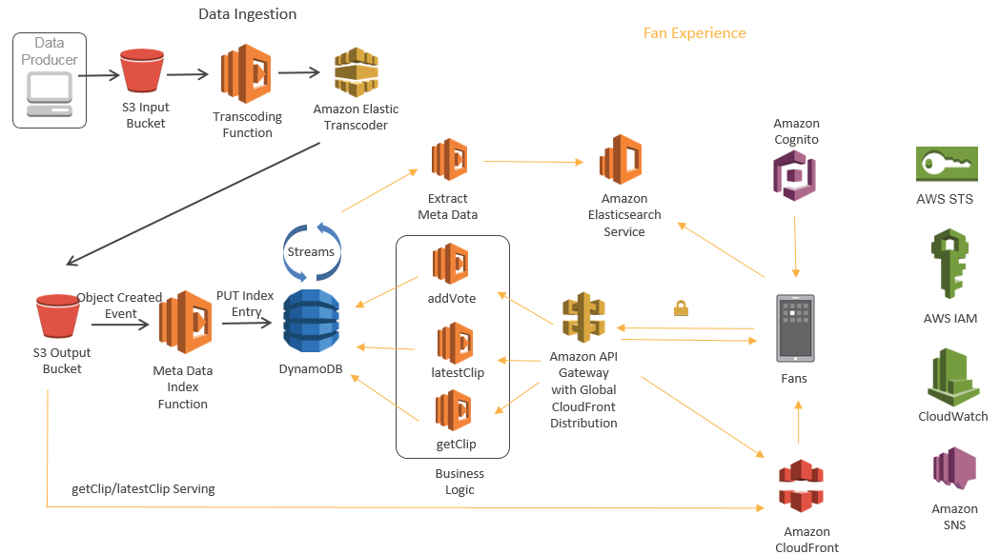

# SeverlessMediaIngestion

<em>Serverless Media Video Ingestion Process on AWS Platform for Customer PoC's</em>

![Alt text] (/SeverlessMediaIngestion/master/Website/html/images/IngestionProcess.png)

<main>
        <section id="about" class="collapse">
            <h1>About</h1>
            
<em>This application has been tested on Firefox ESR 45.7.0 and Google Chrome Version 53.0.2785.116.</em>

            <ol>
                <li>If not already authenticated, click 'Login with Amazon'.
                    This will direct you to login using your 
                    <a href="http://login.amazon.com/">Amazon identity</a> and obtain 
                    <a href="https://aws.amazon.com/cognito/">Amazon Cognito</a> credentials 
                    in order to upload media to an <a href="https://aws.amazon.com/s3/">Amazon S3</a> bucket.
                <li>You will be asked to allow access to your camera and microphone so that an 
                    <a href="https://developer.mozilla.org/en/docs/Web/API/MediaStream">HTML5 MediaStream</a> object can be constructed and played in the 'Live' player. 
                <li>In the 'Live' section, enter a name for the media file you will record and click the record button. This will use the  
                    <a href="https://developer.mozilla.org/en-US/docs/Web/API/MediaRecorder">HTML5 MediaRecorder</a> 
                    object to record media in MPEG4 format.
                <li>Once you have recorded your video, click the stop button. The recorded media will be uploaded to S3 using the 
                    <a href="http://docs.aws.amazon.com/AWSJavaScriptSDK/latest/AWS/S3/ManagedUpload.html">AWS JavaScript SDK ManagedUpload</a> object. 
                    A progress bar will be displayed during the upload.
                <li>Once the media is uploaded, S3 may call an <a href="https://aws.amazon.com/lambda/">AWS Lambda</a> function which will
                    a customer can use to extract metadata  with tools aligning to their business processes.  <a href="https://mediaarea.net/en/MediaInfo" target"moreinfo">MediaInfo</a>, is a popular web example which can store data in
                    a <a href="https://aws.amazon.com/dynamodb/">Amazon DynamoDB</a> table 
                    and start an <a href="https://aws.amazon.com/elastictranscoder/">Amazon Elastic Transcoder</a> job to transcode 
                    the media file into multiple variants of HLS.
                <li>Once the <a href="https://aws.amazon.com/elastictranscoder/">Amazon Elastic Transcoder</a> job is complete, 
                    Elastic Transcoder will publish a message to an <a href="https://aws.amazon.com/sns/">Amazon SNS</a> topic which will execute an 
                    <a href="https://aws.amazon.com/lambda/">AWS Lambda</a> function. This Lambda function will update the
                    <a href="https://aws.amazon.com/dynamodb/">Amazon DynamoDB</a> table with the time the transcode was completed.
                <li>Click 'Refresh' to exemplify a Serverless Update to DynamoDB by populating a list of media previously uploaded.
                
 <h1>Full Application Architecture</h1>
            
<em>This Architecture depicts the full application inclusive of the Fan Experience:</em>

            
![Alt text] (https://github.com/tescal2/SeverlessMediaIngestion/blob/master/Website/html/images/FullApplicationArchitecture_Vote2OverturnInstantReplay.png?raw=true)
            
 <h1>Potential MVP Iterations</h1>
            
<em>This is a potential MVP Iteration in which we add in a Deep learning-based image recognition service called<a href="https://aws.amazon.com/rekognition/">Amazon Rekognition</a> that can be used to enrich the ElasticSearch Cluster by adding labels and level of confidence: </em>

 
![Alt text] (https://github.com/tescal2/SeverlessMediaIngestion/blob/master/Website/html/images/MVP_IterationWithRekognition.png?raw=true?raw=true)
            
